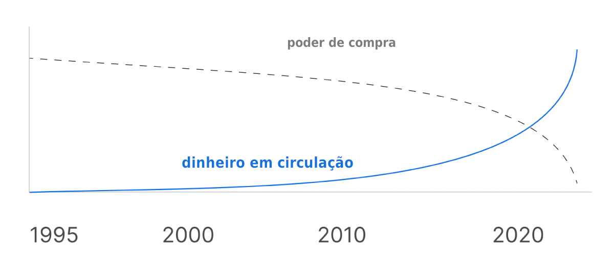
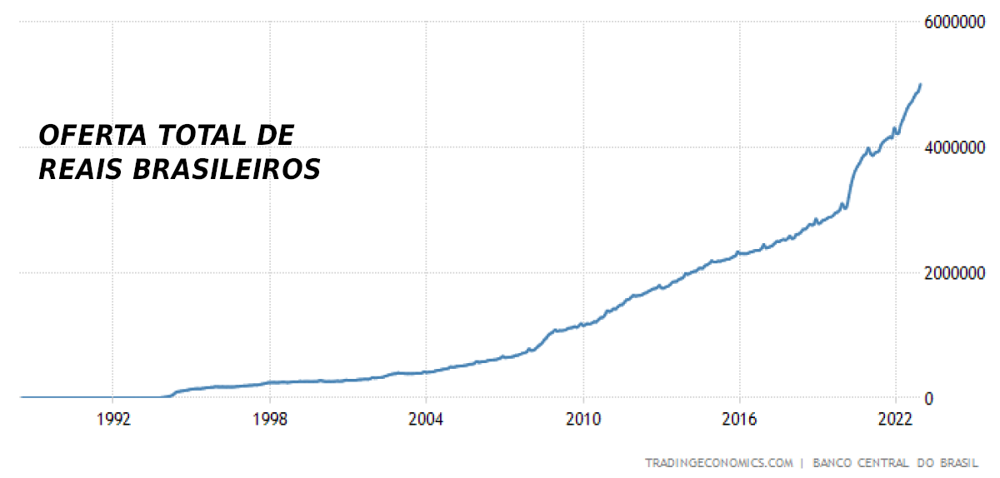
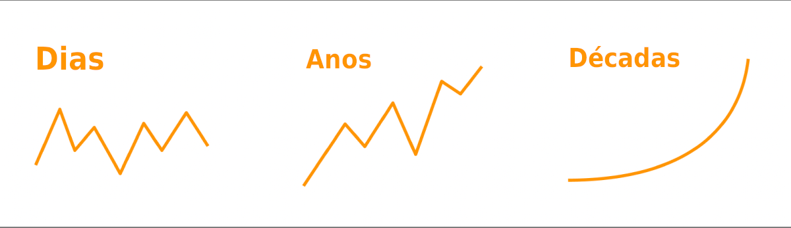

# BITCOIN NÃO TEM INFLAÇÃO
# MAS O REAL TEM

A inflação acontece quando dinheiro é impresso ou criado do nada. Isso faz seu dinheiro valer menos com o passar do tempo.

No Brasil, não há limite fixo em quantos R$ podem ser criados.

À medida que mais R$ são criados através de déficits orçamentários e novos projetos de gastos, os R$ que você tem compram menos com o passar do tempo. Como tantos R$ foram impressos nos últimos anos, o valor dos R$ na sua conta bancária e no seu bolso diminuiu significativamente ao longo do tempo.

Com o Bitcoin, há um limite fixo de 21 milhões de Bitcoins que poderão existir. Como não é possível criar mais Bitcoins, seu valor aumentou significativamente ao longo do tempo.

## O QUE CAUSA INFLAÇÃO?

Embora as cadeias de suprimento e algumas empresas contribuam para o aumento artifical dos preços, a causa primária da inflação é a expansão da oferta monetária.

Cerca de 40% dos R$ em circulação atualmente foram criados entre 2020 e 2022.

Esta foi uma enorme expansão da oferta monetária e não será a última vez que isto acontece.

Quando mais dinheiro é criado do nada, o preço de tudo sobe. Isso inclui os custos de matérias-primas que as empresas têm de pagar pelos seus produtos, o que significa preços mais elevados pra você.

Inflação não é apenas o aumento dos preços. A inflação ocorre quando seu dinheiro passa a valer menos com o tempo.

## O BITCOIN TEM INFLAÇÃO?

Inflação é essencialmente a sua fatia da "torta de dinheiro" ficando menor a cada ano. Então, o Bitcoin tem inflação?

O Bitcoin tem uma oferta fixa de 21 milhões de bitcoins que existirão. O limite dessa oferta de 21 milhões é fixado em código e protegido pela rede de computação mas poderosa do mundo. Este limite não pode ser alterado.

Embora o Bitcoin não tenha inflação, ele tem emissão. A emissão é a porcentagem de novos Bitcoins extraídos a cada ano. Os mineradores de Bitcoin protegem a rede, processam transações de Bitcoin e são pagos por seu trabalho.

Mais de 90% de todos bitcoins já foram mineirados. Mais de 99% de todos 21 milhões de bitcoins serão minerados por volta de 2030, e os 1% restantes serão minerados por volta de 2140.

Embora haja emissão até o suprimento fixo de 21 milhões de bitcoins, o ponto principal é que sua fatia da torta de 21 milhões de bitcoins nunca diminui. Isso é em nítido contraste com o sistema do Real brasileiro, onde sua fatia da torta diminui a cada ano quando mais dinheiro é impresso do nada. Não é possível imprimir mais bitcoins.

## O QUE É BITCOIN?

O Bitcoin é composto por duas partes: um dinheiro digital e uma rede de computadores. Você pode enviar Bitcoin (o dinheiro digital) diretamente para outras pessoas usando a Rede Bitcoin (a rede de computadores).

O Bitcoin representa uma forma radicalmente nova de armazenar e realizar transações de valor. Ao contrário das redes financeiras tradicionais, a Rede Bitcoin pode operar sem autoridades centralizadas ou administradores confiáveis. Isso torna o Bitcoin a primeira moeda aberta e sem fronteiras da história.

O Bitcoin é um dinheiro digital que oferece total controle sobre sua riqueza. Pela primeira vez na história, qualquer pessoa pode possuir um ativo verdadeiramente escasso, que não requer permissão para ser usado e não pode ser confiscado quando armazenado adequadamente.

O Bitcoin pode ser enviado para qualquer lugar do mundo de forma rápida e econômica, sem a necessidade de um intermediário de terceiros, como um banco.

O Bitcoin permite que qualquer pessoa armazene sua riqueza de forma segura, sem se preocupar com a possibilidade de o governo confiscá-la ou diminuir seu valor por meio da impressão de dinheiro.

Você pode facilmente assumir a custódia de seu Bitcoin para ter controle total sobre ele, proporcionando acesso total ao potencial do Bitcoin. Se você pode baixar um aplicativo, pode assumir a custódia do seu Bitcoin e armazenar sua riqueza sem depender de terceiros.

O Bitcoin é um dinheiro melhor.

O BITCOIN PODE PROTEGER MEU DINHEIRO DA INFLAÇÃO?

O Bitcoin historicamente tem sido excelente para proteger as pessoas da inflação de suas moedas locais. Muitas pessoas usam o Bitcoin como uma proteção contra a inflação, armazenando dinheiro que podem manter em Bitcoin por longos períodos.

A oferta de dinheiro em reais brasileiros aumentou de R$427 bilhões para R$589 bilhões em apenas 2 anos, à medida que os políticos imprimiram mais dinheiro. Isso representou um aumento de quase 40% no suprimento de dinheiro, como ilustrado no gráfico abaixo. A oferta fixa do Bitcoin o torna a melhor maneira de preservar seu dinheiro a longo prazo.

Em 2020, o governo brasileiro emitiu uma nova cédula de R$200. Apenas essa nova cédula representou 12,8% de todos os reais impressos naquele ano!

Quando você economiza em Bitcoin, tudo tende a ficar mais barato a longo prazo. Com a moeda governamental, tudo tende a ficar mais caro. Isso destaca a diferença na preservação de valor entre o Bitcoin e as moedas tradicionais.

## OUVI DIZER QUE O BITCOIN É SUPER VOLÁTIL. ISSO É SEGURO?

No curto prazo, o valor do Bitcoin tende a flutuar, mas a volatilidade observada diariamente "desaparece" no longo prazo.

O Bitcoin continua a se tornar cada vez menos volátil ao longo do tempo. À medida que mais pessoas usam o Bitcoin como uma conta de poupança a longo prazo, o valor dele se estabiliza.

Muitas pessoas optam por armazenar valor em Bitcoin por muitos anos como uma maneira segura de minimizar o risco de volatilidade e proteger seu poder de compra ao longo do tempo.

Em alguns países, como Venezuela, Sudão, Líbano, Síria, Argentina, Turquia e muitos outros, o valor da moeda local infla tão rapidamente que o Bitcoin é visto como uma forma mais estável de economizar dinheiro.

## NÃO POSSO COMPRAR UM BITCOIN

Assim como um real é composto por 100 centavos, um Bitcoin é composto por 100.000.000 (100 milhões) de satoshis.

Você não precisa possuir um Bitcoin inteiro. A maioria das pessoas apenas possui satoshis (sats), que são frações de um Bitcoin. Por exemplo, se 1 Bitcoin inteiro custa R$50.000, então R$1 compra 2.000 satoshis!

## O BITCOIN JÁ FOI HACKEADO?

Você pode ter ouvido falar de um "hack do Bitcoin" nas notícias. Muitas pessoas leem esses artigos e acreditam que a Rede Bitcoin foi hackeada, mas isso não é o caso.

O que é a Rede Bitcoin? Bem, pense no Bitcoin, a moeda, como um trem. A Rede Bitcoin são os trilhos do trem.

Quando você lê sobre um hack do Bitcoin nas notícias, na verdade está lendo sobre um custodiante sendo hackeado. Custodiantes são empresas que guardam seu Bitcoin por você. No entanto, isso vem com um risco: perder seu Bitcoin quando a empresa o gerencia de forma inadequada ou sai do mercado. Isso acontece com frequência, por isso é uma ideia melhor assumir a custódia do seu próprio Bitcoin.

A beleza do Bitcoin é que você pode assumir a custódia por conta própria. Isso significa que você pode ter controle total sobre o seu Bitcoin ao baixar sua própria carteira de Bitcoin. Isso pode soar complicado, mas é tão simples quanto baixar um aplicativo.

A Rede Bitcoin nunca foi hackeada e é a rede de computadores mais segura do mundo. Mesmo se você combinasse todos os servidores do Facebook, Amazon, Apple, Netflix e Google, a Rede Bitcoin ainda seria mais poderosa e mais segura.

## O BITCOIN NÃO USA MUITA ENERGIA?

O Bitcoin utiliza energia para garantir a segurança da rede e assegurar que os Bitcoins que você possui não possam ser retirados de você.

O Bitcoin consome uma quantidade significativa de energia, o que é positivo por diversas razões.

- O Bitcoin é a rede de computadores mais segura do mundo.
- O Bitcoin ajuda a estabilizar a rede de energia do Texas por meio da mineração de Bitcoins.
- O Bitcoin reduz as emissões provenientes da perfuração de petróleo.
- O consumo de energia do Bitcoin ainda é menor do que o que os americanos utilizam com as luzes de Natal a cada ano.

